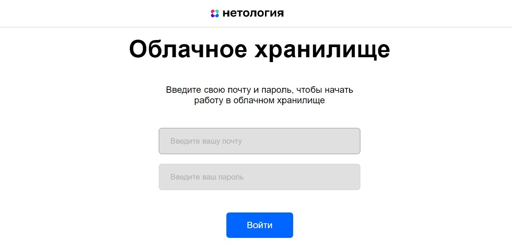

# Дипломная работа “Облачное хранилище”

## Описание проекта

Разработано приложение - REST-сервис. Сервис предоставляет REST интерфейс для возможности загрузки файлов и вывода списка уже загруженных файлов пользователя. 
Все запросы к сервису авторизованы. Заранее подготовленное веб-приложение (FRONT) подключается к разработанному сервису без доработок, 
а также использует функционал FRONT для авторизации, загрузки и вывода списка файлов пользователя.
Сервис реализует все методы описанные [yaml файле](./CloudServiceSpecification.yaml).
FRONT доступен на порту 8080, BACKEND - на порту 5500.

## Информация о пользователях:

- USERNAME: user_1@mail.ru PASSWORD: qwerty123
- USERNAME: user_2@mail.ru PASSWORD: qwerty222

## Описании реализации:

- Приложение разработано с использованием Spring Boot
- Использован сборщик пакетов maven
- Использована база данных mysql
- Использована система управления миграциями liquibase
- Для запуска используется docker, docker-compose
- Код размещен на github
- Код покрыт unit тестами с использованием mockito
- Добавлены интеграционные тесты с использованием testcontainers
- Информация о пользователях сервиса хранится в базе данных
- Информация о файлах пользователей  хранится в базе данных

## Запуск приложения

## Описание и запуск FRONT:

1. Установить nodejs (рекомендуемая версия 14.16.1, версии выше 16 не поддерживаются) на компьютер следуя инструкции: https://nodejs.org/ru/download/
2. Скачать [FRONT](https://github.com/gap1502/netology-diplom-frontend) (JavaScript)
3. Перейти в папку FRONT приложения и все команды для запуска выполнять из нее.
4. В файле .env FRONT нужно изменить url до backend: VUE_APP_BASE_URL=http://localhost:5500
5. Следуя описанию README.md FRONT проекта запустить nodejs приложение командой npm install. Появится папка node_modules.
6. Для запуска FRONT приложения с расширенным логированием использовать команду: npm run serve

## Описание и запуск BACKEND:

1. Скачать данный проект, в терминале выполнить команду ./mvnw clean package
2. С помощью docker запусть docker-compose.yml (docker-compose up). После запуска создадутся все необходимые в базе данных таблицы (с двумя пользователями в таблице users).
3. Изначально все тесты закомментированы чтобы получить jar файл.
4. После запуска и сборки docker контейнера требуется раскомментировать данные тесты и запустить.

## Стартовая страница:

Стандартная форма авторизации ввода логина(почта) и пароля.

## Страница после авторизации:

Изначально список пуст. После добавления файлов страница имеет вид:

1. Кнопка добавить, по нажатию будет предложено какой файл выбрать и загрузить в облачное хранилище.
2. Кнопка редактировать, по нажатию имя файла будет случайно сгенерировано из трех случайных чисел и переименовано.
3. Кнопка загрузить, по нажатию файл скачается из облачного хранилища в локальный компьютер
4. Кнопка корзина, по нажатию будет удален данный файл из облачного хранилища.
5. Кнопка выйти, возвращает пользователя на стартовую страницу.

